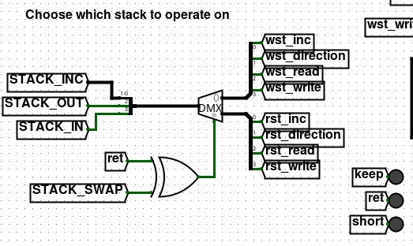

# Uxn-Logisim

Implements the Uxn instruction set in digital hardware. Very WIP.



## Contents

* [cpu.circ](cpu.circ) - The Logisim file
* [microcode.mc](microcode.mc) - Microcode source file
* [microcode-asm.py](microcode-asm.py) - Microcode assembler
* [opcodes.py](opcodes.py) - Definitions for where opcodes live in the microcode ROM

## Known Bugs

- The program counter doesn't reset to 0x0100
  - To fix this, hold down the Reset button attached to the program counter and press Ctrl-T twice to advance the clock. This should set it to 0x0100 and program execution can begin.
  - If your ROM contains absolute addressing then you'll need to manualy zero-pad it to start at 0x0100
    ```sh
    cat /dev/zero | head -c 256 > zero-page.rom
    cat zero-page.rom someprogram.rom > padded-program.rom
    ```
- SFT isn't implemented
- ROT2/ROT2k are unimplemented
- Probably a lot of other opcodes don't work either
- 

## Quickstart

1. Open `cpu.circ` in Logisim
2. ( Optional ) Build the latest microcode
	
	i. To assemble the microcode rom file run
	```sh
	python microcode-asm.py microcode.mc microcode.tal
	uxnasm microcode.tal microcode.rom
	```
	ii. Right click on the ROM labelled `Microcode_ROM`

	iii. Load Image > Select microcode.rom > Select binary (big-endian)
3. Load the Uxn ROM you wish to load.

	i. Right click on the 64K RAM module
	ii. Load Image > Select a UXN rom > Select binary (big-endian)

## Microcode Format

**TODO**

## Microcode Assembler

The microcode assembler is only a partial assembler and relies upon Uxntal assembly for the conversion to binary. It takes in a [format](Microcode Format) similar to tal, and outputs a valid .tal file (Including comments!). Requires uxnasm or asma.tal to assemble into the microcode rom.
